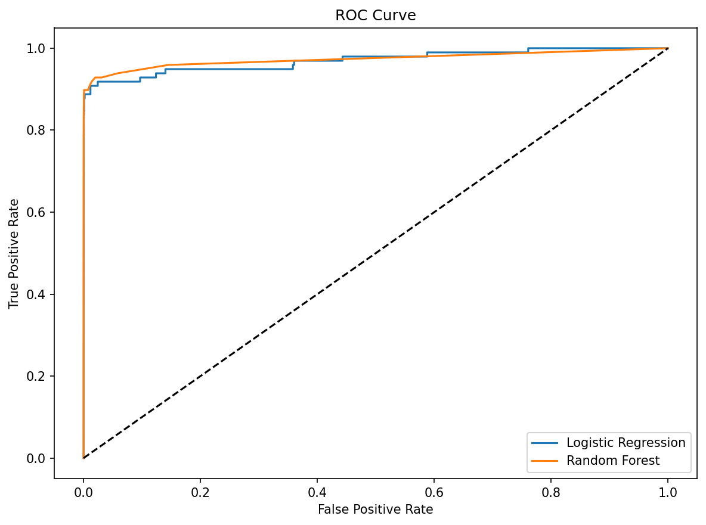
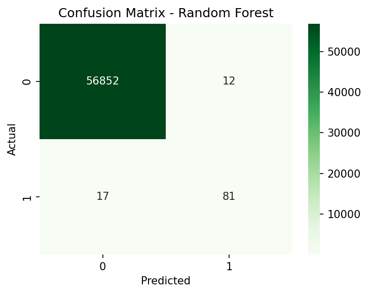
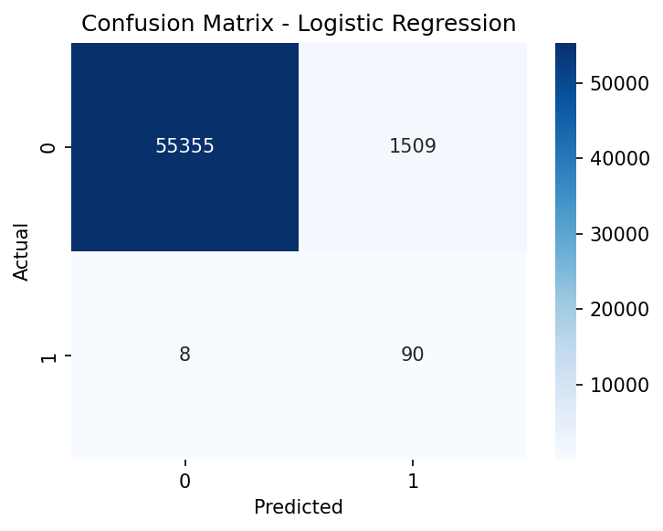
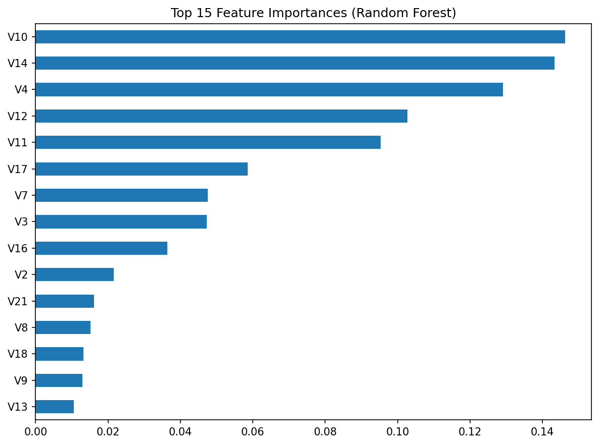

# 📌 Credit Card Fraud Detection using Machine Learning

### 🔍 Project Overview  
This project focuses on detecting fraudulent credit card transactions using **Machine Learning**.  
Since fraud cases are extremely rare (~0.2% of all transactions), this is a **class imbalance problem**.  
I explored the dataset, applied preprocessing, balanced the data with **SMOTE**, and trained multiple models to classify transactions as **Fraud** or **Legitimate**.  

---

## 📊 Dataset  
- Source: [Kaggle – Credit Card Fraud Detection](https://www.kaggle.com/datasets/mlg-ulb/creditcardfraud)  
- Transactions: **284,807**  
- Fraud cases: **492** (0.172%)  
- Features: anonymized PCA-transformed variables (`V1`–`V28`) + `Amount`, `Time`  

⚠️ The dataset is highly **imbalanced**, making it a great real-world case study.  

---

## 🛠️ Tech Stack  
- **Python**  
- **Libraries:** Pandas, NumPy, Matplotlib, Seaborn, Scikit-learn, Imbalanced-learn  

---

## 📌 Steps in the Project  
1. **Exploratory Data Analysis (EDA)**  
   - Checked distribution of fraud vs non-fraud  
   - Visualized transaction amounts and correlations  

2. **Preprocessing**  
   - Scaled `Amount` column  
   - Train-test split  

3. **Imbalance Handling**  
   - Applied **SMOTE** to balance fraud vs non-fraud cases  

4. **Model Training**  
   - **Logistic Regression** (baseline)  
   - **Random Forest Classifier** (stronger performance)  

5. **Evaluation**  
   - Confusion Matrix  
   - Precision, Recall, F1-score  
   - ROC-AUC Curve  

---

## 📈 Results  

### Logistic Regression  
- Recall (Fraud) → **92%** ✅ (caught most frauds)  
- Precision (Fraud) → **5%** ❌ (too many false alarms)  
- ROC-AUC → **0.97**  

### Random Forest  
- Precision (Fraud) → **87%** ✅  
- Recall (Fraud) → **82%** ✅  
- F1-score (Fraud) → **0.85**  
- ROC-AUC → **0.97**  

👉 **Random Forest outperformed Logistic Regression** by achieving a strong balance between precision & recall.  

---

## 📊 Visualizations  
- ROC Curve (Random Forest vs Logistic Regression)  
- Confusion Matrix Heatmaps  

*(Insert screenshots here — upload them to `/results/` and embed using Markdown)*  

---

## 🚀 Future Work  
- Try **XGBoost/LightGBM** for boosting performance  
- Deploy a **Streamlit app** for real-time fraud prediction  
- Build an interactive **dashboard** for transaction monitoring  

---

## 📌 How to Run  
Clone the repo and install dependencies:  
```bash
git clone https://github.com/<your-username>/fraud-detection-ml.git
cd fraud-detection-ml
pip install -r requirements.txt

jupyter notebook notebooks/fraud_detection.ipynb
### Visualizations









